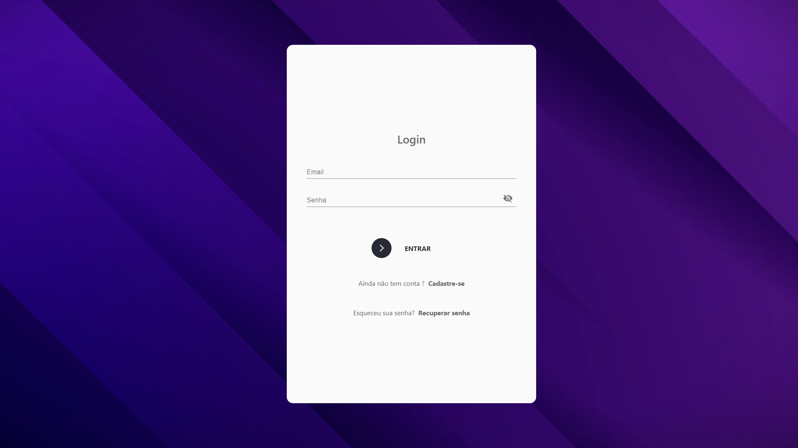
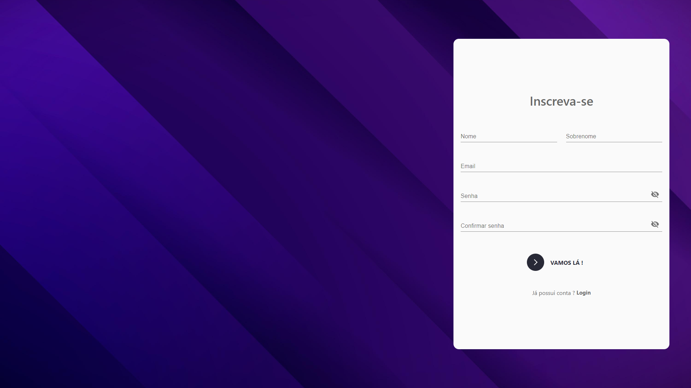

# Login-Project

O Login-Project é um projeto que visa fornecer uma solução completa para autenticação de usuários com um layout bonito e responsivo. Ele inclui inputs dinâmicos e validações para senhas e cadastros, garantindo uma experiência de usuário agradável e segura.

## Funcionalidades

- **Autenticação de Usuários**: O Login-Project permite que os usuários façam login de forma segura, protegendo suas contas com senhas.

- **Cadastro de Usuários**: Novos usuários podem se cadastrar de forma rápida e fácil, fornecendo as informações necessárias.

- **Inputs Dinâmicos**: Os campos de entrada são projetados para fornecer feedback e sugestões em tempo real para melhorar a usabilidade.

- **Validações de Senhas**: O sistema aplica regras de segurança para garantir que as senhas escolhidas pelos usuários sejam fortes e seguras.

- **Layout Responsivo e Bonito**: O design do projeto é responsivo e se adapta a diferentes dispositivos, proporcionando uma experiência consistente e agradável em telas de todos os tamanhos.

## Tecnologias Utilizadas

O projeto utiliza as seguintes tecnologias:

- HTML5, CSS3, React-JS, Typescript, Styled Components e Material UI: Para criar a estrutura e o estilo do frontend, garantindo um layout bonito e responsivo.

- JavaScript: Responsável pela dinâmica dos inputs e implementação das validações de senhas e cadastros.

- [React-JS]: O projeto utiliza um framework de UI para agilizar o desenvolvimento e garantir um design moderno.

## Como Executar o Projeto

Para executar o Login-Project em sua máquina local, siga os passos abaixo:

1. Clone este repositório para o seu computador usando o seguinte comando:

git clone https://github.com/KennedyCordeiro/Login-Project.git

2. Navegue para o diretório do projeto:

cd Login-Project

3. Execute npm install para instalar suas dependências

4. Execute npm start para iniciar em sua tela inicial
